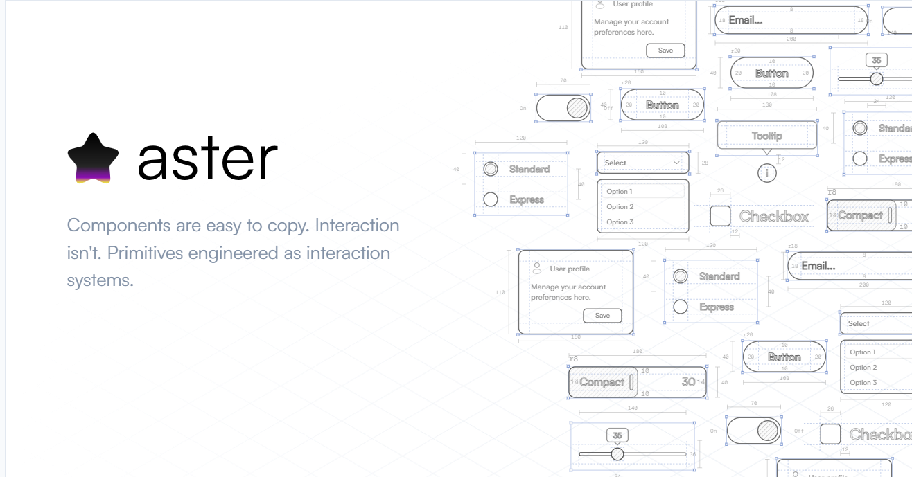

# Aster

Components are easy to copy. Interaction isn't.

[](https://github.com/Rohit-Singh-Rawat/UI/actions/workflows/ci.yml)
[](https://nextjs.org)
[](https://www.typescriptlang.org)
[](https://tailwindcss.com)
[](https://bun.sh)



Aster is a component registry engineered around interaction, not just markup. Every primitive ships with press physics, keyboard parity, accessibility, and motion built in, not bolted on afterward.

**[Website](https://aster.rohitsinghrawat.com)** &nbsp;•&nbsp; **[Browse primitives](https://aster.rohitsinghrawat.com/browse)**

## Installation

Add a primitive to your project with the shadcn CLI:

```bash
npx shadcn@latest add https://aster.rohitsinghrawat.com/r/button.json
npx shadcn@latest add https://aster.rohitsinghrawat.com/r/fader.json
```

## Components

| Primitive | Description |
| --- | --- |
| **Button** | Press physics, keyboard parity, motion tokens |
| **Fader** | A parameter control whose track doubles as the value display, with elastic overdrag and a detent grammar |

## Development

Aster uses [Bun](https://bun.sh) as its package manager and script runner.

```bash
bun install
bun dev
```

Open [http://localhost:3000](http://localhost:3000) to see the site.

```bash
bun run build      # validate the registry, build it, then build the site
bun run lint        # Biome
bun run typecheck   # TypeScript
bun run test        # full test suite
bun run check       # everything above, the CI gate
```

## Testing

Two Vitest projects, defined in `vitest.config.mts`:

| Project | Environment | Covers |
| --- | --- | --- |
| `unit` | jsdom | Logic, ARIA, keyboard, press semantics |
| `browser` | Real Chromium via Playwright | Drag physics, springs, geometry |

```bash
bun run test:unit      # fast, jsdom only
bun run test:browser   # real browser (first run: bunx playwright install chromium)
bun run test           # both
```

New component? Colocate `<name>.test.tsx` beside the source and call `describeAsterConformance` from `test/conformance.tsx`. The registry build fails if a component ships without tests. Layout- or motion-real tests go in `<name>.browser.test.tsx`.

## License

This project is currently private and not licensed for external reuse.
